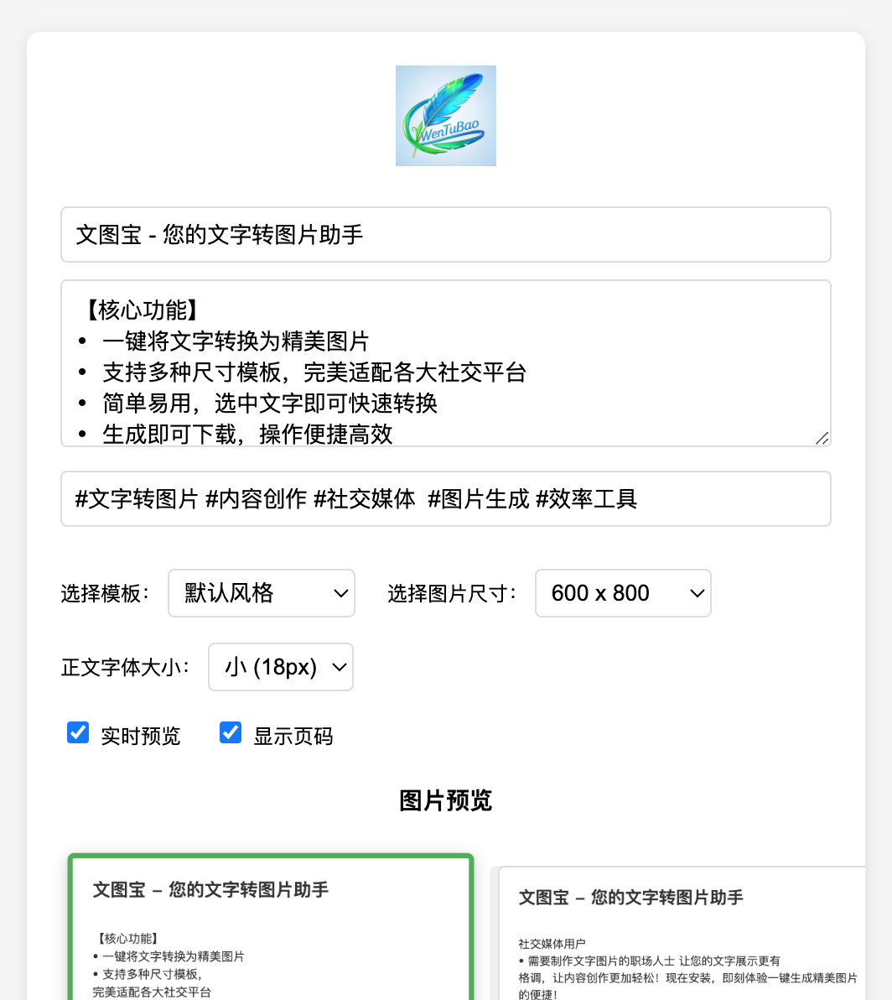
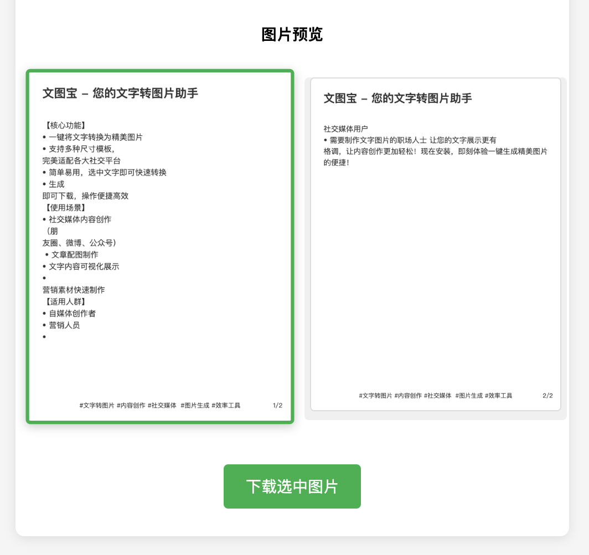
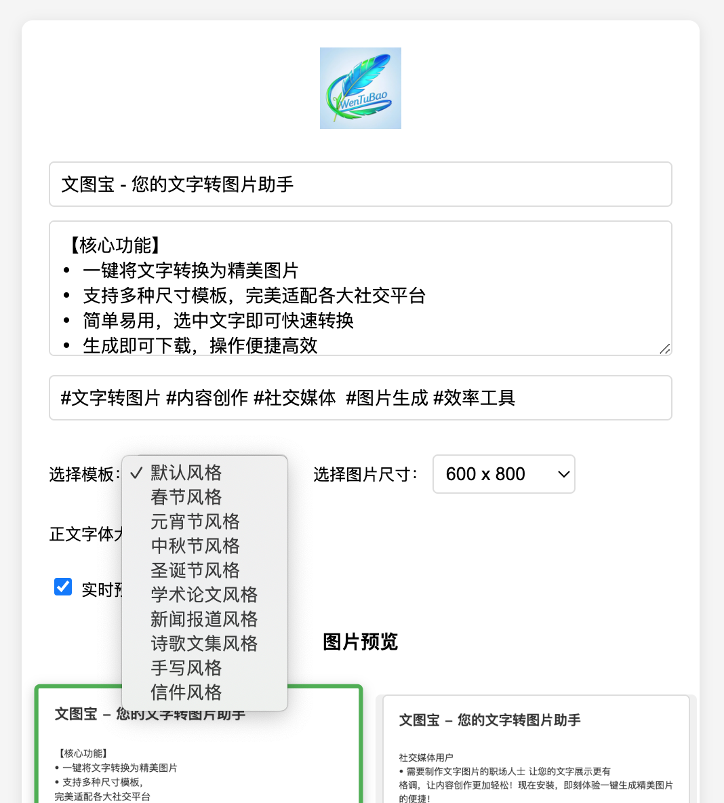

# 文图宝 (WenTuBao)

文图宝是一款强大的Chrome扩展程序，专注于将文字内容快速转换为精美图片。它为内容创作者、营销人员和社交媒体用户提供了一个简单而高效的文字可视化解决方案。

## 🌟 核心功能

- **一键转换**：快速将文字内容转换为精美图片
- **多样模板**：提供10种精心设计的模板风格
  - 默认风格
  - 春节风格
  - 元宵节风格
  - 中秋节风格
  - 圣诞节风格
  - 学术论文风格
  - 新闻报道风格
  - 诗歌文集风格
  - 手写风格
  - 信件风格
- **灵活布局**：支持标题、正文、页尾的自由组合
- **智能分页**：自动处理长文本分页，支持页码显示
- **高清输出**：生成1080x1920高清图片，完美适配各大社交平台

## 🖼️ 效果展示

## 📹 视频演示

观看我们的视频教程，了解文图宝的详细使用方法和效果展示：

[点击观看文图宝使用教程](https://www.youtube.com/watch?v=LA02VKD4YNM&t=45s)

在视频中，我们将为您展示：
- 扩展程序的安装过程
- 基础功能的使用方法
- 各种模板风格的效果
- 实用的使用技巧和建议

## 📥 下载安装

1. **打开Chrome网上应用店**
   - 在Chrome浏览器中访问[Chrome网上应用店](https://chrome.google.com/webstore)
   - 在搜索框中输入"文图宝"

2. **安装扩展程序**
   - 点击文图宝扩展程序页面上的"添加至Chrome"按钮
   - 在弹出的确认窗口中点击"添加扩展程序"

3. **完成安装**
   - 安装完成后，Chrome浏览器右上角工具栏会显示文图宝图标
   - 点击图标即可开始使用

## 📖 使用指南

### 基础操作

1. **启动文图宝**
   - 点击Chrome浏览器右上角的文图宝图标
   - 等待弹出操作窗口

2. **编辑内容**
   - 在标题栏输入文章标题（可选）
   - 在正文框中粘贴或输入要转换的文字内容
   - 在页尾栏添加签名或备注（可选）

3. **选择样式**
   - 从模板下拉菜单中选择喜欢的风格
   - 预览生成效果

4. **生成和保存**
   - 点击"生成图片"按钮
   - 预览满意后点击"下载"保存图片

### 使用技巧

- **长文本处理**：文图宝会自动将长文本分页，每页保持适当的文字数量
- **图片尺寸**：默认输出1080x1920像素的高清图片，适合各类社交平台
- **模板选择**：根据内容性质选择合适的模板，如学术内容选择学术论文风格
- **页面布局**：可以只使用正文，或搭配标题、页尾，灵活组合

### 常见问题

1. **为什么图片无法生成？**
   - 检查是否输入了文字内容
   - 确保网络连接正常
   - 刷新页面重试

2. **如何调整字体大小？**
   - 文图宝会根据内容长度自动调整最佳字体大小
   - 如果文字过多，建议分成多页生成

3. **支持哪些图片格式？**
   - 目前支持PNG格式输出
   - 图片质量为高清1080P

## 💡 使用场景

- **社交媒体内容创作**
  - 朋友圈文章配图
  - 微博长文图片
  - 公众号图文素材
- **营销内容制作**
  - 产品介绍图
  - 活动宣传图
  - 文案展示图
- **个人使用**
  - 文字摘录保存
  - 笔记内容分享
  - 诗文创作展示

## 🚀 快速开始

1. 在Chrome浏览器中安装文图宝扩展
2. 点击工具栏中的文图宝图标
3. 在弹出窗口中：
   - 输入标题（可选）
   - 填写正文内容
   - 添加页尾签名（可选）
4. 选择喜欢的模板风格
5. 点击生成按钮即可预览
6. 满意后点击下载保存图片

## 🎯 适用人群

- 自媒体创作者
- 营销策划人员
- 社交媒体用户
- 企业品牌运营
- 个人创作爱好者

## 🔄 更新日志

### V1.5
- 新增10种精美模板风格
- 优化文字排版算法
- 支持长文本智能分页
- 增加页码显示功能
- 提升生成图片质量

## 📝 隐私说明

文图宝重视用户隐私保护，所有文字转换均在本地完成，不会上传任何用户内容。详细隐私政策请参见[隐私政策文档](文图宝隐私政策.md)。

## 👨‍💻 欢迎贡献

我们非常欢迎开发者参与文图宝项目的开发和改进！无论是修复bug、添加新功能，还是改进文档，您的每一份贡献都将帮助文图宝变得更好。

### 如何贡献

1. **提交Issue**
   - 发现bug？请详细描述问题和复现步骤
   - 有新想法？欢迎提出功能建议
   - 使用疑问？我们很乐意帮助解答

2. **提交代码**
   - Fork本项目到您的仓库
   - 创建新的分支：`git checkout -b feature/your-feature`
   - 提交您的修改：`git commit -m '添加新功能：xxx'`
   - 推送到您的仓库：`git push origin feature/your-feature`
   - 创建Pull Request

3. **编码规范**
   - 保持代码风格一致
   - 添加必要的注释
   - 更新相关文档
   - 确保代码通过测试

### 行为准则

- 尊重每一位贡献者
- 积极参与技术讨论
- 接受建设性的批评
- 遵循开源社区规范

## 🤝 联系我们

如有任何问题或建议，欢迎通过以下方式联系：
- VX: xiaochenwin

---

让您的文字展示更有格调，让内容创作更加轻松！现在安装文图宝，即刻体验一键生成精美图片的便捷！

#文字转图片 #内容创作 #社交媒体 #图片生成 #效率工具
